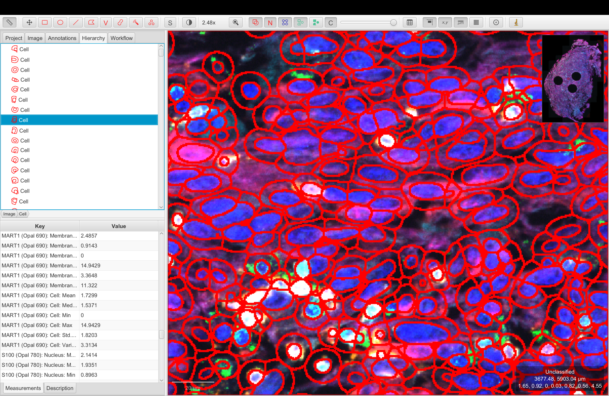
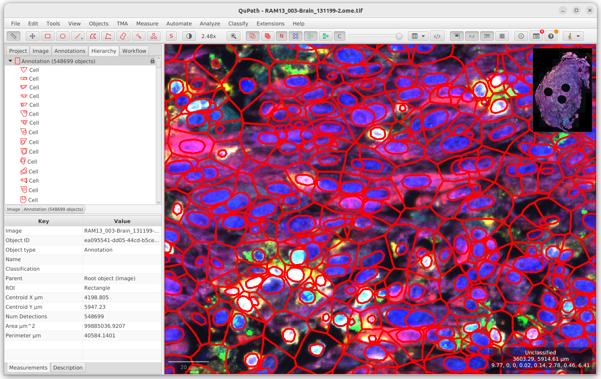

# Importing Masks from DeepCell to QuPath

[](https://jupyterlab.readthedocs.io/en/stable)
[](https://www.python.org)
[](https://www.tensorflow.org)
[](https://qupath.github.io/)
[](https://paquo.readthedocs.io/)
[](https://deepcell.readthedocs.io/)

<p align="center">
  
  <br>
  <em>Figure 1: Example Result</em>
</p>

Welcome to an open-source DeepCell to QuPath tutorial! This document contains several scripts that when run together allow you to apply DeepCell's Mesmer model for detecting cell nuclei in QuPath. Note: you can already do this for small cropped images via ImageJ's DeepCell plugin, but this pipeline is designed for processing whole-slide images where you have tens of thousands or hundreds of thousands of cells, that is, images that are too large to pass into ImageJ. Moreover, this pipeline also generates pseudo-cytoplasms for your nuclei so that you can have a better estimate of marker intensities per cell to do cell classification.

Shoutout to the [Image.SC Forum](https://forum.image.sc/), especially [Dr. Pete Bankhead](https://www.ed.ac.uk/pathology/people/staff-students/peter-bankhead), for helping me with figuring this out!

## Description

This pipeline connects a deep-learning powered cell segmentation model to open-source software that can perform neighborhood analysis and clustering.

Using this pipeline will convert Mesmer-generated instance segmentation masks of nuclei from a fluorescence ome-tiff to PathCellObjects in QuPath with auto-generated cytoplasms, from which a csv containing x/y coordinates and marker intensities per cell can be readily downloaded via QuPath's user interface. In other words, it is like using QuPath's StarDist plugin but with a deep learning model.

## How To Use

Prerequisites: desktop version of QuPath installed

Recommended: to avoid dependency issues, do everything in the provided conda environment

```shell
conda deep2q create -f environment.yml
conda activate deep2q
```

Time Estimate for standard CODEX-output with ~20k cells: 1 hour 40 minutes

- Step 0: 2 minutes
- Step 1: 17 minutes
- Steps 2 & 3: 62-80 minutes
- Step 4: 1 minute

### Step 0: Image Pre-Processing

Note: if your fluorescence image is already in the right format for QuPath to read and understand, you may skip this step.

1. Obtain your multiplex fluorescence tiff from CODEX and save as a .tif file.

2. The CODEX outputted tiff doesn't have the required metadata for QuPath to recognize the channels. Therefore, do the following:

   - Open the CODEX tiff in QuPath. It should be monochrome as of now. Then open [step-0.groovy](step-0.groovy) using Scripts --> Open Script Editor --> File --> Open.

   - Run the groovy script and save the ome tiff.

### Step 1: Generating Nuclei Masks via Mesmer

DeepCell's Mesmer deep learning model is specifically designed to segment cells in multiplex fluorescence images. It can either simply segment the nuclei based on a DAPI channel or it can segment both nuclei and cytoplasms if there is a cytoplasmic channel.

The default configuration of this pipeline assumes there is no cytoplasmic channel in your image.

The following step will require at least 75 GB of RAM. You may choose to run it in Google Colab Pro (in which case use [step-1-colab.ipynb](step-1-colab.ipynb)) or on a suitable server or desktop.

1. Open [step-1.ipynb](step-1.ipynb) and modify the file path to be that of your ome tiff.

2. Run the notebook. It should save a `mask.npy` (and a `cytoplasms.npy` if you are using method 2 for the next step) that is an instance segmentation mask of your image's DAPI.

Note: there are optional cells containing code for visualization of the masks. You can uncomment lines and adjust image slices to display channels you want to visualize as well as the mask overlay.

### Steps 2 and 3: Adding Cells to QuPath + Generating Measurements

Note: In the future, if `paquo` API implements an `add_cellObject()` method, this current setup may be updated to also do step 3 in Python, combining the two steps.

The below two methods take a similar amount of time. The primary bottleneck is generating measurements for each cell which is done in QuPath in both methods. For more customizability, one may prefer to use Python's cell expansion in Method 2. For slightly smoother cytoplasm boundaries, one might prefer QuPath's built-in groovy cell expansion in Method 1.

<p align="center">
 <strong> Figure 2: Comparison of both methods </strong>
</p>

|            |              |
| :-------------------------------------------: | :---------------------------------------------: |
| a. Cytoplasms Generated via Voronoi in Groovy | b. Cytoplasms Generated via Watershed in Python |

<p align="center">
  
  <br>
  <em>Figure 3: StarDist Nuclei Detection and Cell Expansion</em>
</p>

Note: if you do not care about creating pseudo-cytoplasms for your cells, you may simply run [step-2-m1.ipynb](step-2-m1.ipynb) to transfer the DAPI into QuPath and either modify [step-3-m1.groovy](step-3-m1.groovy) to perform measurements or do so manually from the QuPath

This is by far the most time-consuming step as it can take an hour or so for QuPath to do measurments per cell on an image with ~20,000 DAPI.

The point of creating the pseudo-cytoplasms is to have a rough estimate of what the cytoplasms should be given that we have no cytoplasmic marker. This can help us with cell classification downstream as it is easier for markers to be assigned to cells.

Before you proceed:

- Make sure you have necessary Python dependencies installed via `pip install -r requirements.txt`

- Ensure `QuPath.exe` resides in usr/bin so that `paquo` can readily find it

#### Method 1: Voronoi Tessellation in Groovy

##### Converting DAPI Into QuPath PathDetectionObjects

1. Open [step-2-m1.ipynb](step-2-m1.ipynb) on your desktop (or wherever you have QuPath installed).

2. Run the cells (3 minutes or so for ~20,000 DAPI). This automatically creates a new QuPath project in the specified folder and adds the DAPI masks as detection objects to your fluorescence image.

##### Convert the PathDetectionObjects into PathCellObjects

1. Open the QuPath project you created in the previous step

2. Open the [step-3-m1.groovy](step-3-m1.groovy) via Scripts --> Open Script Editor --> File --> Open and run.

3. Wait for about 60 minutes as it uses Voronoi tessellation to generate a cytoplasm for each nuclei and make measurements of shape and marker intensities within the ROI regions. (Most of the time is spent on the measurements.)

#### Method 2: Merging Python Cytoplasms and Nuclei to QuPath CellObjects

If you would rather use the `cytplasms.npy` we created in Python in step 1 instead of relying on Groovy's Voronoi tessellation, proceed with the following:

1. Make sure to have run the optional cell in step 1 that generates the `cytoplasms.npy`. Save the numpy array instance labels for both your DAPI and Cytoplasms to your local computer where QuPath is installed.

2. In the same folder you saved those npy arrays, run [step-2-m2.ipynb](step-2-m2.ipynb) with the correct file path names to add both the cytoplasms and nuclei as detection objects to a new QuPath project (about 3 minutes). Notice how because we used skimage's cell expansion in step 1, the instance labels match between a given nucleus and its expanded cytoplasm. We will leverage this in the next step.

3. Run [step-3-m2.groovy](step-3-m2.groovy) to convert the detections into cellObjects and generate measurements (about 75 minutes). This script associates the correct nucleus with its expanded cytoplasm based on the names we gave them in step 2. Relying on QuPath's `resolveHierarchy()` method would require the cytoplasms to be created as annotations and would take much longer.

### Step 4: Proceed to Do Cell Classification, Neighborhood Analysis, Visualization, etc.

Now your CellObjects should look just as if they were created via StarDist but they used DeepCell instead! You can proceed to train a cell classification model in QuPath or you can save the .txt, .tsv, or .csv representing your cells and their measurements and read in the data to Python/R/MATLAB to perform your own neighborhood analysis.

To export measurements from QuPath:

- Go to Measure --> Select "Cells" --> Export as CSV

See [How To Export Measurements](https://qupath.readthedocs.io/en/stable/docs/tutorials/exporting_measurements.html) for more examples of how to do this.

Example of neighborhood analysis to be added.

## Credits

This pipeline was put together as part of my research under [Professor Willy Hugo](https://www.uclahealth.org/cancer/members/willy-hugo) at UCLA Health.

Sincere appreciation for the support of the Image.SC Forum, especially Dr. Pete Bankhead for helping write some of these scripts and answering key questions about how to work with QuPath's scripting interface!

Last Updated: February 10, 2024

[](https://www.ucla.edu)
